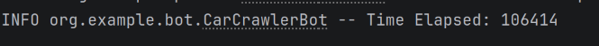

# Car Scraper and Analyzer

This Java project scrapes car listings from [999.md](https://999.md/ro), processes the data, writes it to a CSV file, filters cars based on specific criteria, and calculates basic statistics (lowest price, highest price, average price). The project uses Selenium for web scraping, Apache Commons CSV for CSV handling, and dotenv for configuration.

## Features

- Scrape car listings from 999.md
- Extract car details: Name, Model, Generation, Year, Mileage, Price, and Link
- Convert prices to Euro (supports MDL and USD)
- Save scraped data to CSV
- Load CSV and filter cars based on environment variables (`CAR`, `MODEL`, `GENERATION`, `YEAR_MIN`, `YEAR_MAX`, `MIN_MILEAGE`, `MAX_MILEAGE`)
- Calculate basic statistics: lowest price, highest price, average price

## Getting Started

### Prerequisites

- Java 17+
- Maven or Gradle for dependencies
- Chrome browser installed
- ChromeDriver compatible with your Chrome version
- `.env` file with the following variables:

```
CAR=RENAULT
MODEL=MEGANE
GENERATION=III (2008 - 2016)
YEAR_MIN=2015
YEAR_MAX=2016
MIN_MILEAGE=200000
MAX_MILEAGE=300000
```

### Running the Program

he program will scrape car listings, save the data to `cars_data.csv`, filter cars according to the `.env` configuration, and print statistics:

```
Lowest price: 5000€
Lowest link: https://999.md/ro/...
Highest price: 20000€
Highest link: https://999.md/ro/...
Average price: 12000€
```
---

### Elapsed Time
For the default configuration, the elapsed time for scraping and filtering the cars is:


## Limitations

- **Website changes break your scraper**:  
  The scraper relies on hardcoded XPaths and CSS selectors. If 999.md changes its DOM structure (element classes, IDs, hierarchy), scraping will fail.

- **CSV memory usage**:  
  Reading the entire CSV into memory using `readFile()` works for small datasets but may fail or be inefficient for very large datasets (tens of thousands of cars).

- **Parsing limited to Romanian pages**:  
  The scraping and parsing logic is designed specifically for the Romanian version of 999.md. It may not work correctly for pages in other languages or formats.

- **Sequential scraping**:  
  The current implementation scrapes car pages one by one. This can be slow for large numbers of cars.
---